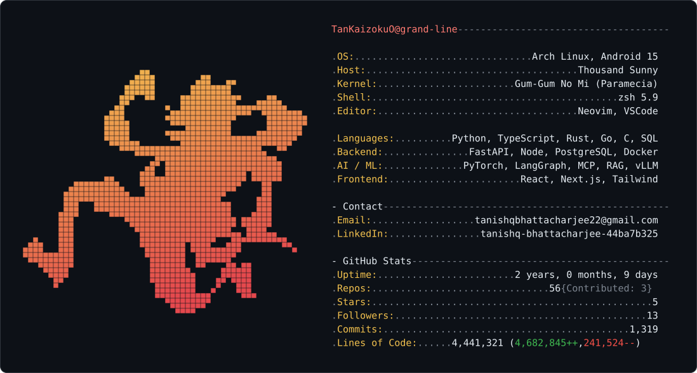

<picture>
  <source media="(prefers-color-scheme: dark)" srcset="./dark_mode.svg" />
  <source media="(prefers-color-scheme: light)" srcset="./light_mode.svg" />
  
</picture>

# Featured Projects

### [Sibyl-SQL](https://github.com/TanKaizokuO/Sibyl_SQL) — Conversational Postgres with unforgeable access control
Natural-language database agent where security is enforced by PostgreSQL Row-Level Security, not the app layer. ReAct planning, SSE reasoning traces, auto-rendered charts/maps.

### [Biomedical QA](https://github.com/TanKaizokuO/BioMedical_QA) — Evidence-grounded answers, measured for faithfulness
Atomic-claim QA with citation attribution and a full evaluation harness: faithfulness, retrieval quality, calibration, abstention — 30+ ADRs and 31 test modules.

### [Nakama-kun](https://github.com/TanKaizokuO/nakama_kun) — Verification-driven autonomous coding agent
LangGraph terminal agent that refuses to claim success it can't prove. Pytest-aware, evidence-store grounded, long-term memory via SQLite + ChromaDB. 59 test modules.

### [Backend Curriculum](https://github.com/TanKaizokuO/backend-curriculum) — Sixteen lessons, from socket to deploy
Starts at `socket.accept()`, ends at TLS and reverse proxies. Every benchmark is real: B-tree index taking 11.8 ms → 0.128 ms, N+1 penalty measured with added latency.

### [mcpctl](https://github.com/TanKaizokuO/MCP_2) — Reading the MCP spec closely
CLI + reference servers comparing MCP `2025-11-25` vs `2026-07-28`: stateful sessions → stateless `_meta` routing, plus OAuth. `--verbose` prints raw protocol frames.

### [Nakama](https://github.com/TanKaizokuO/nakama) — Agent runtime in Rust
Same problem as Nakama-kun, solved in Rust to find what the Python version hid. Tokio SSE streaming, sandboxed tool dispatch, MCP bridge, automatic transcript compaction.

### [C-Learn](https://github.com/TanKaizokuO/C-Learn) — Machine learning library in C
Hand-rolled matrices, dense layers, backprop, optimizers — no dependencies. Numerical gradient checking, fused sigmoid+BCE, end-to-end examples on Titanic.
